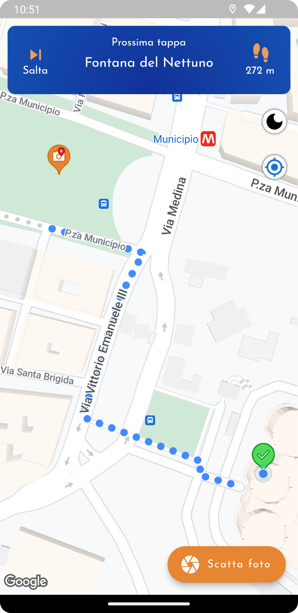
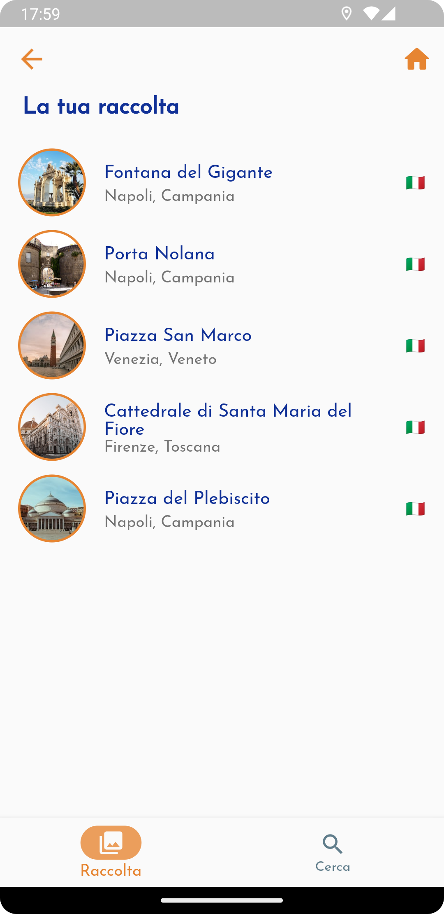

# artS

University project made for the course "Enterprise Mobile Application Development" of University of Salerno ("UNISA").

  <picture>
    
  </picture>
     
    <small><i>Logo of the app</i></small>

## Description
The application has the following features:

From users perspective:
- Point of interest recognition
- Custom itineraries
- Collection and Search
- Sidequest
- Profile (badge, edit password)
- Rewards section (under the form of QR codes)
- Settings (language, theme)

From partners perspective:
- Profile (with edit password)
- Settings (language, theme)
- Add a new reward
- Scan user's rewards (QR codes)

## Technologies and services used
- Oracle Cloud Virtual Machine
- Google Firebase
- Spring Boot
- Google Maps, Places API, Routes API, Cloud Vision API
- Unity Engine
- Flutter

## Some screenshots of the app

| Name | Screenshot |
| ------ | ------ |
| Sidequests |  |
| Itinerary |  |
| Partner (Profile) |  |
| 3D model |  |
| Point of interest |  |
| Custom itinerary |  |
| Collection |  |
| Registration |  |
| Login |  |
| Add reward |  |
| Homepage |  |
| Mission completed |  |